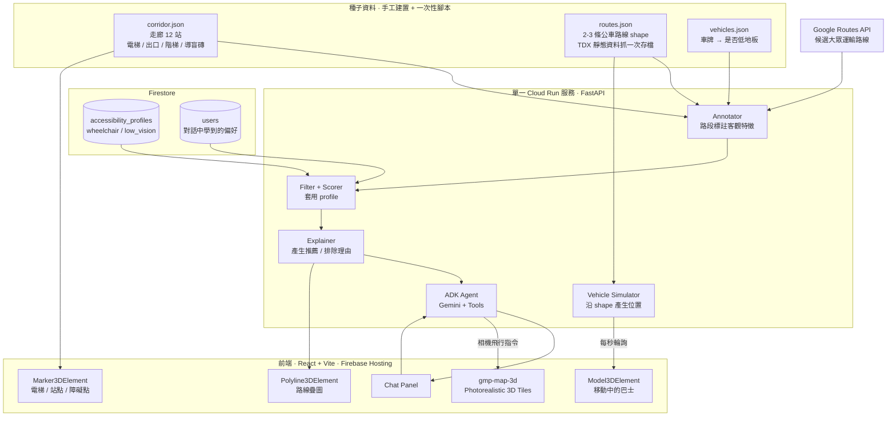
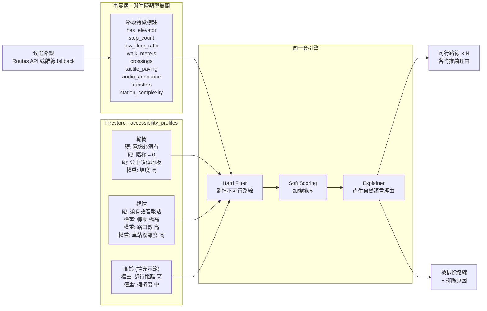
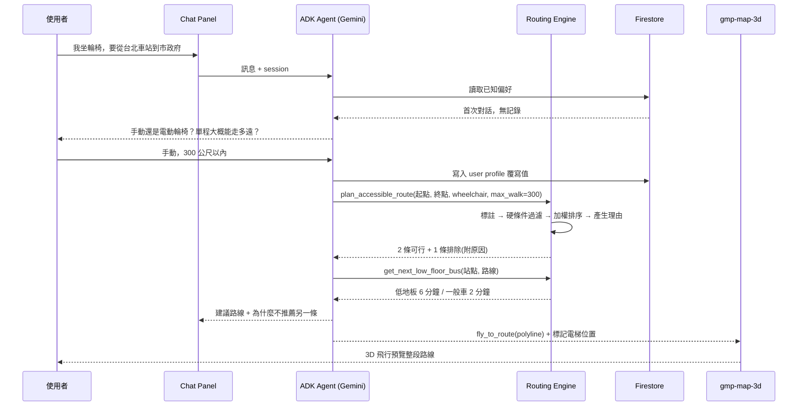
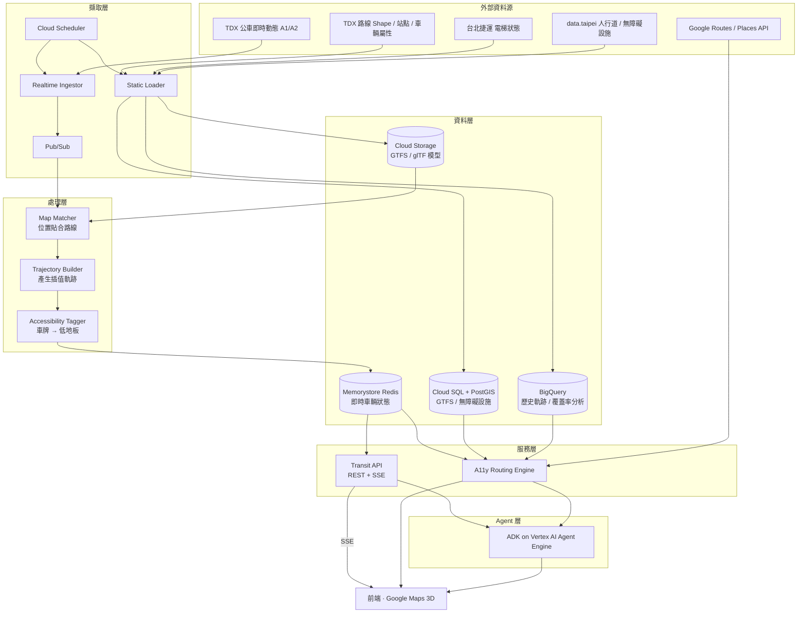

# Taipei Pulse — 架構文件

無障礙導向的台北 3D 大眾運輸路線服務。以 Google Cloud 為基礎，透過對話式 agent
為不同障礙類型的使用者提供差異化的路線建議。

- **服務對象**：輪椅使用者、視障者（架構可擴充至高齡者等）
- **示範範圍**：捷運板南線 台北車站 ↔ 市政府 走廊及沿線公車
- **開發限制**：1 天、1 名開發者

---

## 1. 一日版架構（今天要做的）

刻意的簡化：單一容器、單一 Firestore、其餘皆為靜態 JSON。
不用 Pub/Sub、不用 Redis、不用 Cloud SQL、不用 Vertex AI Agent Engine。

---

## 2. 核心設計：Profile 驅動的路線評分

系統最重要的設計決定是**把「世界的客觀事實」與「這個人的需求」徹底分離**。

不為每種障礙寫一套路由演算法。改為：路段標註中立的客觀特徵，
每種障礙是一組儲存在 DB 的硬條件與軟權重。新增障礙類型 = 新增一筆資料，而非新增程式碼。

設計要點：

- **`unknown` 是合法值。** 資料缺漏時不假裝精確，由 agent 明白告知使用者。
- **被排除的路線要保留並回傳。** 「這條快 8 分鐘但那個出口只有樓梯，所以不推薦」
  比單純隱藏不可行路線更能建立信任。
- 輪椅與視障的需求**會互相衝突**（電梯 vs 導盲磚、可接受轉乘 vs 極度厭惡轉乘），
  因此同一組起終點會產生截然不同的建議。這是本專案的核心價值主張。

---

## 3. Agent 對話流程

Agent 不只回覆文字，它同時回傳結構化指令來操作 3D 地圖。

Agent 存在的正當性建立在四件它不可被下拉選單取代的事：

1. **問出使用者不會主動申報的隱性需求**（手動/電動輪椅、可上幾公分門檻、步行上限）
2. **把模糊語言翻譯成 profile 參數**（「我腳不太方便」→ 套哪個 profile、調哪些權重）
3. **解釋權衡，特別是解釋為什麼不推薦**
4. **記住**，第二次對話不需重問

---

## 4. 完整願景架構（Roadmap，用於簡報）

一日版刻意砍掉的部分。展示團隊知道這個系統該長成什麼樣。

一日版與完整版的差異：

| 面向 | 一日版 | 完整版 |
|---|---|---|
| 車輛位置 | 沿真實 shape 模擬 | TDX 即時動態 |
| 位置精度 | 直接繪製 | Map matching + 插值 |
| 無障礙資料 | 手工建置 12 站 | 自動擷取全市 |
| 資料庫 | Firestore | Cloud SQL + PostGIS + Redis |
| Agent 部署 | 內嵌於 Cloud Run | Vertex AI Agent Engine |
| 地理範圍 | 單一走廊 | 全台北 |

---

## 5. 已知風險與限制

| 風險 | 影響 | 緩解方式 |
|---|---|---|
| `gmp-map-3d` 仍為 Preview | API 可能變動 | 一日專案可接受；車輛圖層抽象在 interface 後 |
| TDX 低地板欄位覆蓋率未經驗證 | 核心功能可能無資料 | 改用手工建置的 `vehicles.json` |
| 視障相關開放資料稀少 （導盲磚、有聲號誌未確認存在） | 視障 profile 較為啟發式 | 改用可推導的代理指標：轉乘次數、路口數、車站複雜度、語音報站；並由 agent 明確告知資料信心度 |
| Routes API 需啟用計費 | Demo 可能開天窗 | 固定示範起終點的候選路線寫入離線 JSON fallback |
| Photorealistic 3D Tiles 不供應 EEA 地區 | 不影響台灣 | 無 |
| Google Routes API 的 `TransitPreferences` 僅有 `LESS_WALKING` / `FEWER_TRANSFERS`， **沒有輪椅無障礙選項** | 無法直接取得無障礙路線 | 這正是本專案自建評分引擎的理由 |

---

## 6. 圖表的產出方式

本文件所有圖表皆為 [Mermaid](https://mermaid.js.org/) 語法，四種取得圖檔的方式：

1. **GitHub** — push 上去後 `.md` 裡的 mermaid 區塊會自動渲染，不需任何工具。
2. **VS Code / Kiro** — 開啟 Markdown Preview（`Ctrl+Shift+V`）即可預覽。
3. **[mermaid.live](https://mermaid.live)** — 貼上程式碼，右上角 Actions 可匯出 PNG / SVG。
   要放進簡報時這是最快的方式，零安裝。
4. **本機批次產圖** — 見 `docs/README.md`，一行指令輸出全部 PNG 與 SVG。
