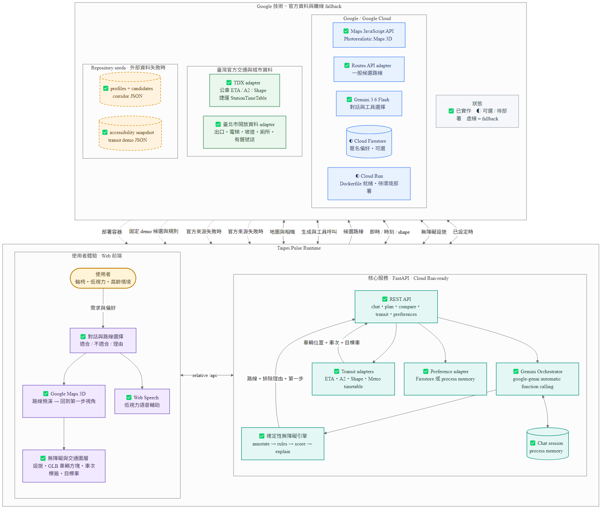
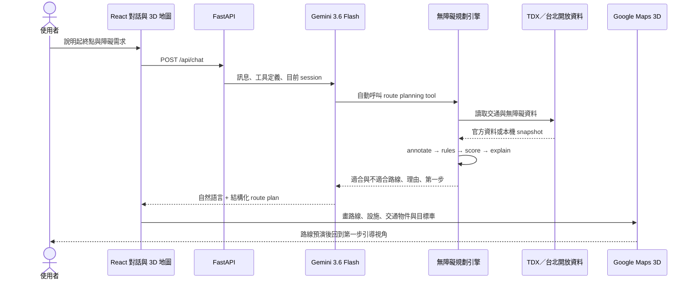
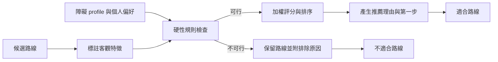

# Taipei Pulse — 最終 MVP 系統架構

Taipei Pulse 是以無障礙需求為核心的台北大眾運輸路線服務。使用者先透過對話描述需求，系統再以固定規則與權重比較候選路線，最後在 Google Maps 3D 中預演路線、回到使用者視角，並標記第一段要前往的設施與目標交通工具。

> **目前示範範圍**：台北車站到市政府的固定走廊；支援輪椅與低視力情境。這是可離線展示的 MVP，不代表全台北即時導航已上線。

## 架構總覽



可編輯版本：[Mermaid 原始檔](system-architecture.mmd) · [SVG 向量圖](system-architecture.svg)

圖中的實線是主要執行路徑，虛線是外部資料不可用時的本機 fallback。Cloud Run 與 Firestore 都已有程式介面，但 Cloud Run 是否實際部署、Firestore 是否啟用，仍由部署環境決定。

## 使用者流程



## 路線決策方式

候選路線的客觀特徵與使用者需求分開處理。新增需求類型時，優先調整 profile 規則與權重，而不是複製一套路由程式。



- 輪椅情境會優先無階梯、無障礙電梯、坡道與低地板車輛；必要時接受繞路。
- 低視力情境會提高導盲磚、有聲號誌、語音提示與低複雜度轉乘的權重。
- 缺少資料時保留 `unknown` 與信心來源，不把模擬值包裝成官方即時資料。
- 不適合路線仍回傳，讓使用者理解「較快但不可達」的原因。

## 主要元件

| 層級 | 已實作元件 | 責任 |
| --- | --- | --- |
| Web | React 19、Vite 7、TypeScript | 對話、路線選擇、狀態面板與使用者操作 |
| 3D 地圖 | Google Maps JavaScript API、Maps 3D | 路線、設施、交通物件、相機預演與第一步視角 |
| 無障礙呈現 | 3D polyline、facility marker、GLB 車輛方塊、HTML label、Web Speech | 顯示電梯／坡道／導盲資訊、車次簡述、目標車與語音輔助 |
| API | FastAPI | 提供 health、profile、preference、route、transit scene 與 chat API |
| Agent | `google-genai` automatic function calling、Gemini 3.6 Flash | 將自然語言轉成工具呼叫並解釋規劃結果 |
| 規劃引擎 | annotate → rules → score → plan／explain | 產生可驗證且可重現的路線排序，不把決策完全交給模型 |
| 交通資料 | TDX ETA／A2／Shape／捷運時刻 | 建立公車與捷運物件、估算位置及標記目標班次 |
| 無障礙資料 | 臺北市開放資料 + snapshot | 出入口、電梯、坡道、廁所與有聲號誌；失敗時可離線展示 |
| 偏好儲存 | Firestore（可選）+ process-memory fallback | 匿名使用者偏好；未設定 Firestore 時仍可展示 |
| 部署 | `api/Dockerfile`、Cloud Run-ready | 後端容器可部署到 Cloud Run；前端仍需另接靜態託管與 `/api` proxy |

## Google 技術的使用邊界

| Google 技術 | 在 MVP 中的用途 | 狀態 |
| --- | --- | --- |
| Google Maps JavaScript API / Maps 3D | Photorealistic 3D 地圖、路線與互動物件 | 已整合，建議使用 `weekly` channel |
| Google Routes API | 提供一般候選路線，供自建無障礙規則二次評分 | 有 API key 時使用，否則走固定候選資料 |
| Gemini API | 對話理解、工具選擇與結果解釋 | 已整合；預設模型 `gemini-3.6-flash` |
| Firestore | 匿名使用者偏好 | 可選；未設定專案時退回行程記憶體 |
| Cloud Run | FastAPI 容器部署 | Dockerfile 已就緒，實際部署狀態依環境而定 |

> Google Routes API 本身沒有完整的輪椅無障礙路由條件，因此 Taipei Pulse 會把 Routes 候選結果與官方／模擬的無障礙設施資料合併，再由確定性規則引擎判斷。

## 資料來源與 fallback

| 資料 | 主要來源 | fallback | 前端用途 |
| --- | --- | --- | --- |
| 公車到站與位置 | TDX ETA、A2 | transit demo JSON + 時刻／shape 內插 | 移動車輛、ETA、低地板與目標車 |
| 公車路徑 | TDX Shape | corridor／demo path | 避免車輛穿越建築物 |
| 捷運班次 | TDX StationTimeTable | demo timetable | 站間物件與目標列車 |
| 出入口與無障礙設施 | 臺北市開放資料 | accessibility snapshot | 電梯、坡道、廁所、號誌標記 |
| 使用者 profile | repository JSON | — | 輪椅／低視力規則與權重 |
| 候選路線 | Google Routes API + repository JSON | 固定示範 corridor | 適合／不適合路線比較 |
| 使用者偏好 | Firestore | process memory | 最大步行距離、障礙需求等覆寫值 |

## 執行與部署邊界

```text
Browser (Vite SPA)
  └─ relative /api requests
       └─ reverse proxy / same origin
            └─ FastAPI container on Cloud Run
                 ├─ Gemini API
                 ├─ Google Routes API
                 ├─ TDX / Taipei Open Data
                 └─ Firestore (optional)
```

- 本機開發由 Vite proxy 將 `/api` 導向 FastAPI。
- 正式環境需讓前端與 API 同源，或在靜態託管層設定 `/api` reverse proxy；目前 repository 未綁定特定前端託管服務。
- API 目前沒有登入、細粒度授權與 rate limiting，適合比賽展示，不應直接當成公開生產服務。
- 不要把 `.env`、Google Maps key、Gemini key 或 TDX credentials commit 到版本控制。
- Chat session 與未啟用 Firestore 時的偏好都存在單一 process memory；多副本 Cloud Run 不共享這些狀態。

## MVP 已完成與後續工作

### 已完成

- 對話產生與比較適合／不適合路線，並解釋取捨。
- Google Maps 3D 路線預演、回到使用者視角與第一步提示。
- 輪椅／低視力 profile、無障礙設施標記與語音輔助。
- 公車與捷運物件依 shape／時刻移動，顯示車次簡述並突出目標車。
- TDX／臺北開放資料介接與離線 demo fallback。
- Firestore 偏好 adapter 與 Cloud Run-ready FastAPI container。

### 後續工作

- 擴大到全台北，建立定期同步、資料版本與品質監測。
- 將交通物件升級為即時 map matching、完整生命週期與精細車模。
- 將 chat session 改為可跨副本共享的持久化狀態。
- 補上驗證、rate limiting、secret rotation、監控與服務等級目標。
- 用實地稽核與使用者測試校正無障礙規則、坡度與設施可用性。

## 圖表重新產生

```powershell
cmd /c "npm run architecture:png"
cmd /c "npm run architecture:svg"
```

其他內嵌 Mermaid 圖可用 `npm run diagrams` 重新輸出到 `docs/build/`。
